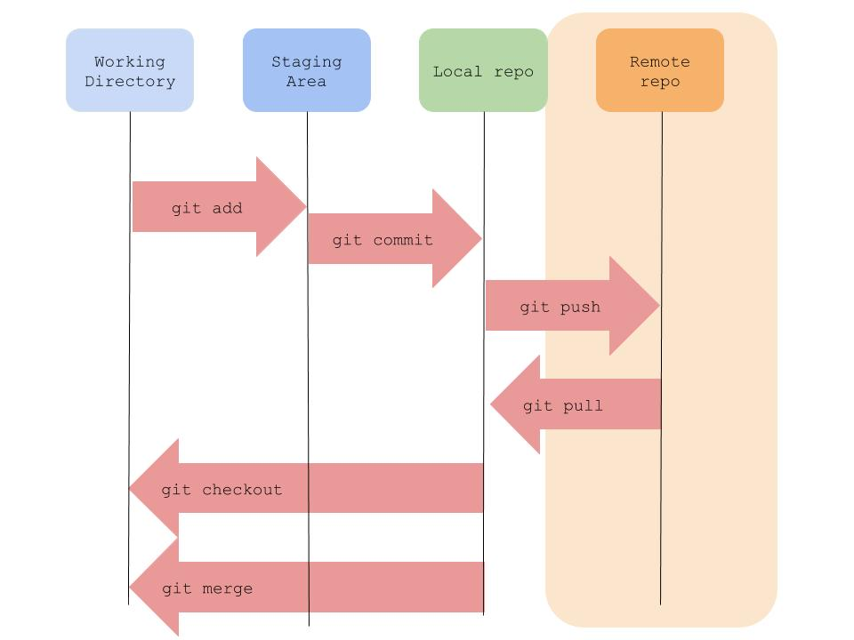

# git-tutorial

# Table of Contents
 1. [Required](##Required)
 1. [How Git Works](##how-git-works)
 2. [Steps](##Steps)
    1. [Create github repository](###Create-github-repository)
    1. [Clone repository](##clone-repository)
    1. [Add file to repository](##add-file-to-repository)
        1. [Create file](####create-file)
        1. [Add file](####add-file)
    1. [Commit Messages Explained](###commit-messages-explained)
    1. [Update index.html](###update-index.html)
    1. [Add style customization to index.html](###Add-style-customization-to-index.html)
        1. [Create styles.css](####Create-styles.css)
    1. [Check commit history](###Check-commit-history)
    1. [Navigate through branches](###Navigate-through-branches)
    1. [Update master branch with the branch we just created](###Update-master-branch-with-the-branch-we just-created)
    1. [Send changes to git server(github.com)](###Send-changes-to-git-server(github.com))


## Required:
[Git](https://git-scm.com/downloads) installed 
<br/>
[Visual Studio Code](https://code.visualstudio.com) installed 
<br/>
[Github](https://code.visualstudio.com) account created
## How Git Works:

<br/>
The repository has for states:
1.  Working directory: where I edit , create and delete files
1.  Staging area, where the changes in the working directory are selected to be saved
1.  Local repo: where the changes are in the staging area are saved, using
```bash
git commit -m "example"
```
1.  Remote repo: it is a web server hosting git, we are going to use github.com but there are some alternatives like gitlab.com, bitbucket.com
## Steps
### Create github repository
-   Go to github.com, login if you haven't
-   Create repository, name it git-tutorial (and leave it as public, create readme)
### Clone repository
-   Open file explorer
-   Create directory call Repositories in Documents
-   Go inside Repositories
-   Right click and select git bash here
-   Type in git bash
```bash
git clone https://github.com/{{USERNAME}}/git-tutorial.git
Cd git-tutorial
```
-   Open Visual Studio Code (in git bash)
```bash
code .
```

Once visual studio code is open, go to terminal, new terminal
### Add file to repository
#### Create file
-   Create index.html
-   Lets Add this code to index.html
```HTML
<!DOCTYPE html>
<html>
<head>
</head>
<body>


<h1>This is a heading</h1>
<p>This is a paragraph.</p>


</body>
</html>
```
#### Add file
-   We can see that there is a file in the workspace that is not added to the staging area because the file name is in <span style="color:red">red</span> color,
```bash
git status
``` 
-   let’s add it (Tab to complete file name)
```bash 
git add index.html
```
-   We can check that the file is now in the staging area because the file is in <span style="color:green">green</span> color
```bash
git status
``` 
-   The changes in the staging area need to be saved with a description of what we did, and git will give it a unique hexadecimal number
``` 
git commit -m “feat: add index webpage”
``` 
-   We can check that now there aren't files in the staging area
```bash
git status
``` 
### Commit Messages Explained
About the commit message it is recommended to start with this format: <type>: <description>
There are 2 main <type>s, feat and fix.
Feat mean feature, it is used when the software does something new
Fix is used when something was not working as expected and had to be fixed
<description> : a description of what changed in code, starting with a present tense verb like add/update/remove/create
Fore complex projects check how to use conventional commits here: https://www.conventionalcommits.org/en/v1.0.0/

### Update index.html
-   Change 
``` html
<p>“This is the paragraph”</p>
``` 
for 

``` html
<p>“This is THE paragraph”</p>
``` 
- we can check that there is a file that was **modified** that is not in the staging area,
```bash 
git status
```  
- let’s add it
```bash 
git add index.html
```
- Now the change in the index.html is in the staging area 
```bash 
git status
```  
- let’s save that change 
```bash 
git commit -m “fix: update paragraph”
```
-   Let’s go and see how the index.html works
### Add style customization to index.html
We are currently working on a branch called **master**, we can check that  
```bash
git branch
```
We now are going to add a new feature to our code, we are going to add style to the webpage, and as we don't want our main code to break, we are going to create a new branch, and the name of that branch has to describe what we want to achieve.
```
git checkout -b add_style
```
now we are in the new branch add_style, let’s check that
```bash
git branch
```
- we can se that we are currently in branch add_style
#### Create styles.css
We just created styles.css file, lets add some style customizations to it.
Add:
```css
body {background-color: powderblue;}
h1   {color: blue;}
p    {color: red;}
```
Save file
, we add this to the staging area
```bash 
git add style.css
```
We now Update index.html, adding inside head tag 
```html
<link rel="style" href="styles.css">
```
-   lets add that change to the staging area 
```bash
git add index.html
```
-   We can check that there are two files in the staging area
```bash 
git status
```  
-   Let's save that
```bash 
git commit -m “feat: add styles to index.html”
```  
-   Let’s go and see how the index.html works, 
-   we can see that the changes were correctly applied
### Check commit history
Let’s check the commit history, where all the commits are shown, as well as the difference in commits between one branch and another
```bash 
git log --oneline
```  
### Navigate through branches
We have two branches
```bash 
git branch
```  
To navigate branches we type “git checkout <branchname>”, note that when adding -b tag git creates a new branch git the current branch commits.
Let’s checkout the master branch 
```bash 
git checkout master
```
### Update master branch with the branch we just created
Let’s go and see how the index.html works, as you can see the webpage doesn't have style, because those changes were saved on branch add_style. Now that we know that code in add_style works well we can add it to our main branch.
```bash
git merge add_style
```
now all the commits in add_style are in master
Now lets check the commit history
```bash 
git log --oneline
```  
### Send changes to git server(github.com)
Now we dont want to loose the code we have done, so lets save it in the remote repository(github.com in this case)
```bash 
git push
```  
As we are using Github we might be asked github username and password
Once the code is pushed, go go github.com, find the repository you just created and check the changes

Don’t forget to like the video and subscribe for more programming videos.
